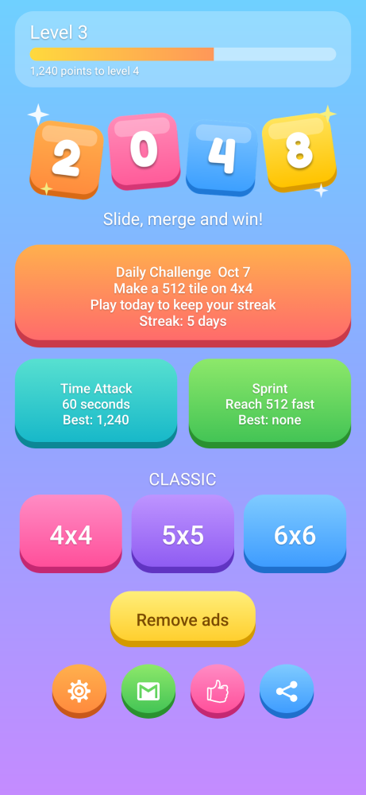
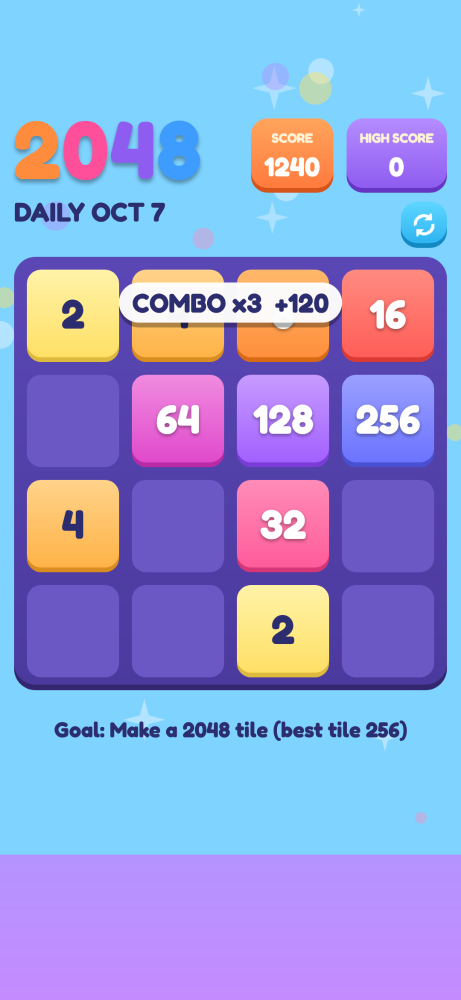

# 2048 Puzzle

 

_Screens rendered from the real layouts and board code._

Android 2048 game with a permanent bottom ad banner that players remove with a one-time in-app purchase.

- Boards: 4x4, 5x5, 6x6, undo, tile removal, endless mode, custom background color
- Daily Challenge: one shared puzzle per UTC day (same tile sequence and goal for everyone), unlimited retries, best score of the day, daily streak, shareable result
- Time Attack: 60 seconds, every merge adds time, beat your best score
- Sprint: reach 512 as fast as you can, tracks your best time
- Progression: player level from all points scored, bonus points for daily goals, optional evening reminder (only sent if you have not played that day)
- Combos: merge on consecutive moves to build a streak; the score bonus grows from +50% up to +200% of the move's points, with a pop-up banner
- Milestones: banner and stronger haptic feedback when you create a 256+ tile (512+ for the strong buzz)
- Ads: Google AdMob adaptive banner (bottom of the menu and game screens). Every request is tagged child-directed with a G content rating, so ads are non-personalized and there is no consent form
- Monetization: one-time "Remove ads" product through Google Play Billing, with "Restore purchase" in Settings
- Language: English only

## Before you publish

1. **AdMob**: the release block of `app/build.gradle` holds the live App ID and banner unit ID. Debug builds always use Google's test IDs, so tap ads only there. After publishing, link the app to its Play listing in AdMob. In Play Console, choose the target audience that matches the child-directed ad settings in the code.
2. **Play Console**: create a one-time in-app product with ID `remove_ads` (or change `REMOVE_ADS_PRODUCT_ID` in `app/build.gradle`). Billing only works from a build uploaded to a Play Console test track, installed from Google Play.
3. **Identity**: change `applicationId` / `namespace` if `com.emeraldwall.puzzle2048` is not the ID you want, and set `support_email` in `app/src/main/res/values/strings.xml`.
4. Publish a privacy policy that mentions AdMob and complete the Play Console Data safety and Ads declarations.

## Build

Requires JDK 17 and the Android SDK.

```
./gradlew assembleDebug
```

## License and credits

MIT, see [LICENSE](LICENSE). This game derives from the open source 2048 code by Gabriele Cirulli and the Android ports built on it, all MIT licensed. Keep the license notices when you distribute the app.

## Launcher icon

The adaptive icon (with themed-icon layer) and legacy fallbacks live in `app/src/main/res/mipmap-*`. `store/play_store_icon_512.png` is the 512px version for the Play Console listing.

## Modes and retention notes

- Daily puzzles come from `modes/DailyChallenge.java` (goal list and seed). Add goals to the `GOALS` array to change the rotation; a new daily goal should stay achievable within a few minutes of play.
- Progress (level, streak, records, reminder choice) is local on the device in `modes/ProgressStore.java`. There are no accounts or leaderboards; add a backend later if you want global rankings.
- Undo, tile removal and board snapshots are Classic only, so Daily, Time Attack and Sprint results stay comparable.
- Run `./gradlew testDebugUnitTest` for the unit tests of the daily seed, goals, streak and level maths.

## Look and feel

- Candy colour palette for the tiles, board, buttons and dialogs: edit `app/src/main/res/values/colors.xml` and the `cell_rectangle_*`, `btn_*` drawables. The game background color is `colorBackground`.
- Chunky 3D-style buttons and tiles are layer-list drawables, so they scale to any screen without extra image files.
- Font: Fredoka Bold by the Fredoka Project Authors, SIL Open Font License 1.1 (`app/src/main/assets/Fredoka-OFL.txt`). Keep that license file with the app.
