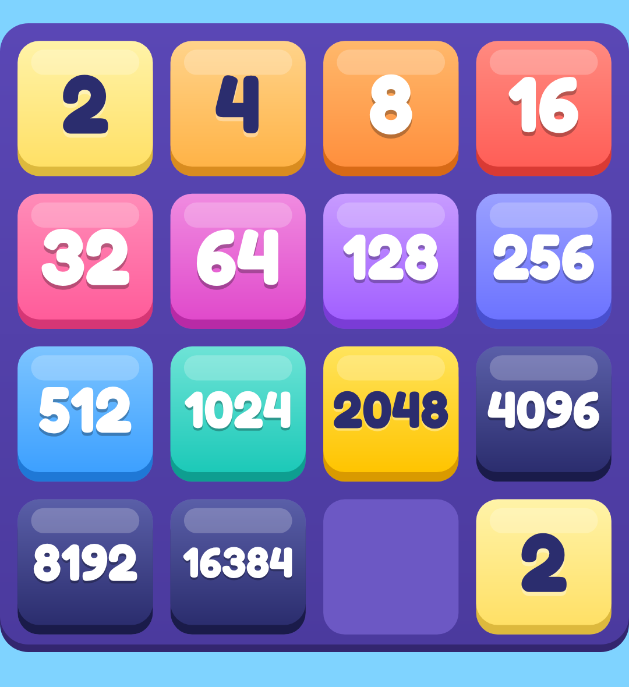
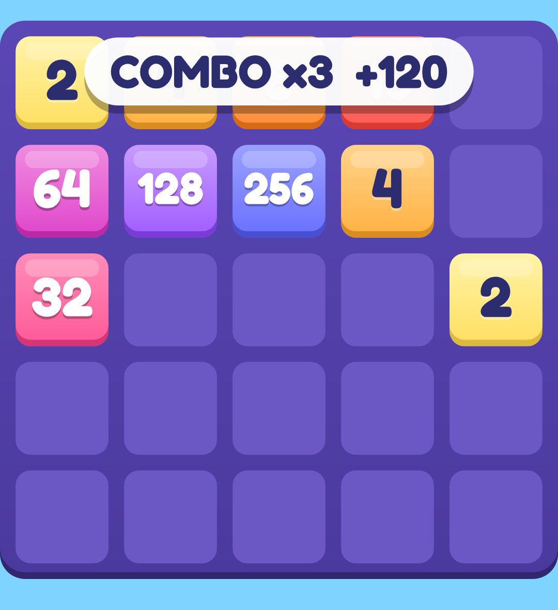

# 2048 Puzzle

A colourful 2048 game for Android with a permanent ad banner that players remove with a one-time purchase.
Written in C# with .NET MAUI, so it opens, builds and runs from Visual Studio.


 

_These images are drawn by the game's own board renderer (`tools/Puzzle2048.Preview`)._

## What is in the game

- **Classic** on 4x4, 5x5 and 6x6 boards with undo, a tile-removal power-up and a saved game
- **Daily Challenge**: one puzzle per UTC day, the same tile sequence and goal for everyone, unlimited retries, best score of the day, a daily streak and a shareable result
- **Time Attack**: 60 seconds, every merge adds time
- **Sprint**: reach 512 as fast as you can
- **Combos**: merge on consecutive moves for up to +200% bonus points
- **Levels**: every point you score fills a level bar; completing a daily goal adds bonus points
- **Daily reminder**: optional, one evening notification, only if the daily challenge has not been played yet
- **Ads and purchase**: Google AdMob banner at the bottom of every screen, removed by a one-time Google Play purchase (`remove_ads`)
- English only, portrait, Android 7.0 (API 24) and newer, 64-bit devices

## Build it with Visual Studio

You need **Visual Studio 2026** (version 18 or newer). The project targets .NET 10, which Microsoft supports only from Visual Studio 2026.

1. In the Visual Studio Installer, install the **.NET Multi-platform App UI development** workload. Make sure the Android SDK and Java options of that workload are ticked.
2. Open `Puzzle2048.sln`.
3. Set **Puzzle2048.App** as the startup project, pick **Android Emulator** or your USB-connected phone, and press **Run**. Debug builds always show Google's test ads.

### Make an APK or a Play Store bundle

- **Release APK** (install it directly or share it): right-click **Puzzle2048.App**, choose **Publish** or **Archive** (the name depends on your Visual Studio version), then **Distribute** and choose the ad hoc option. Create a keystore when asked.
- **Google Play bundle (.aab)**: same steps, choose the Google Play option. Release builds make a bundle by default.
- **From a command line**:

```
dotnet publish src/Puzzle2048.App -f net10.0-android -c Release -p:UseApk=true ^
  -p:AndroidKeyStore=true -p:AndroidSigningKeyStore=my.keystore -p:AndroidSigningKeyAlias=mykey ^
  -p:AndroidSigningKeyPass=env:KEY_PASS -p:AndroidSigningStorePass=env:STORE_PASS
```

Leave out `-p:UseApk=true` to get the `.aab`. Keep the keystore file and its passwords safe and backed up. Without them you can never publish an update. Never commit them.

## Before you publish

1. **Support email**: set `SupportEmail` in `src/Puzzle2048.App/Services/AppConstants.cs`.
2. **Version**: raise `ApplicationVersion` in `Puzzle2048.App.csproj` for every upload to Google Play.
3. **AdMob**: the release build uses the live ids in `AppConstants.cs` (`AdConfig`). After the app is live, link it to its Play listing in AdMob. Do not tap live ads yourself.
4. **Play Console**: create a one-time in-app product with id `remove_ads`. Purchases only work in a build installed from Google Play, for example from an internal test track.
5. **Children**: every ad request is tagged child-directed with a G rating, so ads are non-personalized and there is no consent form. Make the target audience, ads and advertising ID answers in Play Console match. The Google ads library adds the `AD_ID` permission to the manifest, so review that answer carefully.
6. **Privacy policy**: publish one that mentions AdMob and the purchase.

## Project layout

| Folder | What it holds |
| --- | --- |
| `src/Puzzle2048.Core` | Game rules, modes, scoring, daily challenge, progress. No UI, fully tested |
| `src/Puzzle2048.Rendering` | Draws the board and animates moves. Uses vector text, so it looks the same on every phone |
| `src/Puzzle2048.App` | The Android app: screens, ads, billing, reminders |
| `tests` | Unit tests for the rules, progress and rendering helpers |
| `tools/Puzzle2048.Preview` | Draws boards to PNG files, to check the look without a phone |
| `tools/generate_glyphs.py` | Rebuilds the vector font data from the Fredoka font |

Run the tests with `dotnet test tests/Puzzle2048.Tests` or from Test Explorer.

## Licenses and credits

- Font: Fredoka Bold by the Fredoka Project Authors, SIL Open Font License 1.1 (`src/Puzzle2048.App/Resources/Raw/Fredoka-OFL.txt`, shown in the app under About). Keep that file with the app.
- Libraries: .NET MAUI, Google Mobile Ads (AdMob) and Plugin.InAppBilling, under their own licenses.
- This is proprietary, closed-source software. All rights reserved, see [LICENSE](LICENSE). Keep this repository private.
